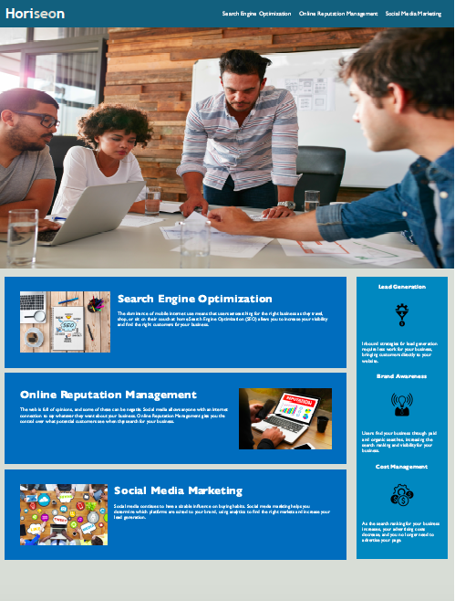

# code_refactorhw1

Horiseon marketing website tailored to ensure web accessiblilty for people with disablilites. This website has been modified to follow accessiblity standards making the site optimised for search engines.

## Modifications 

* <title> element added.
* Images embeded to the webpage.
* "Search Engine Optimization" top right, linked to the bottom card.
* CSS selectore and properties are organized, commented and follow semantic structure.
* Footer not diplayed to mirror demo. 

### Horiseon Webpage

The following image is a screenshot of the webpage

Appliacation URL 
[Application URL](https://fasicasr.github.io/code_refactorhw1/)

